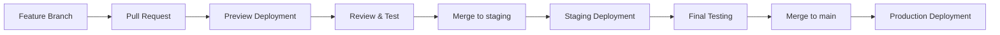

# AMS Audio Homepage Testing

[](https://github.com/Darkness308/ams-Audio-Homepage-testing/actions/workflows/deploy.yml)
[](https://github.com/Darkness308/ams-Audio-Homepage-testing/actions/workflows/deploy-staging.yml)

## 🚀 Deployment-Strategie

Dieses Repository verwendet eine Multi-Environment-Strategie für iteratives Testing:

### Umgebungen

| Environment | Branch | URL | Beschreibung |
|------------|--------|-----|--------------|
| 🟢 **Production** | `main` | [darkness308.github.io/ams-Audio-Homepage-testing/](https://darkness308.github.io/ams-Audio-Homepage-testing/) | Live-Website |
| 🟡 **Staging** | `staging` | [darkness308.github.io/ams-Audio-Homepage-testing/staging/](https://darkness308.github.io/ams-Audio-Homepage-testing/staging/) | Test-Umgebung |
| 🔵 **Preview** | PR | `darkness308.github.io/ams-Audio-Homepage-testing/pr-<nummer>/` | Automatische PR-Previews |

### Workflow



### Deployment-Prozess

#### 1. Feature-Entwicklung mit Preview
```bash
# Neuen Feature-Branch erstellen
git checkout -b feature/neue-funktion

# Änderungen committen
git add .
git commit -m "Add neue Funktion"

# Push und PR öffnen
git push origin feature/neue-funktion
```

➡️ **Ergebnis**: Automatisches Preview-Deployment unter `pr-<nummer>/` + Kommentar im PR mit URL

#### 2. Staging-Test
```bash
# Nach PR-Review: Merge in staging
git checkout staging
git merge feature/neue-funktion
git push origin staging
```

➡️ **Ergebnis**: Deployment auf Staging-Umgebung für umfassende Tests

#### 3. Production-Release
```bash
# Nach erfolgreichem Staging-Test: Merge in main
git checkout main
git merge staging
git push origin main
```

➡️ **Ergebnis**: Deployment auf Production

### Lokale Entwicklung

```bash
# Dependencies installieren
npm install

# Development Server starten
npm run dev

# Build für Production testen
npm run build
npm run preview
```

## 🛠️ Tech Stack

- **Framework**: React 18 + TypeScript
- **Build Tool**: Vite 6
- **Styling**: Tailwind CSS 3
- **Animation**: Framer Motion
- **Icons**: Lucide React
- **Deployment**: GitHub Pages mit GitHub Actions

## 📝 Hinweise

- **Öffentliche Sichtbarkeit**: Alle Deployments (Production, Staging, Preview) sind öffentlich zugänglich
- **Preview-Cleanup**: PR-Previews bleiben auch nach dem Merge bestehen (manuelles Cleanup empfohlen)
- **Branch-Protection**: Erwäge Branch-Protection-Rules für `main` und `staging`

## 🔒 Für private Tests

Falls du private Tests benötigst, erwäge:
- Repository auf privat stellen (erfordert GitHub Pro für Pages)
- Alternative Hosting-Plattformen (Netlify, Vercel, Cloudflare Pages)
- Client-seitige Authentifizierung